**Espais d’Emmagatzematge Windows 11**

## **Configuració inicial:**

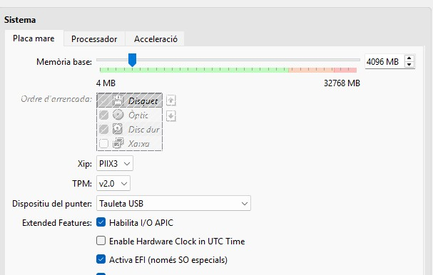

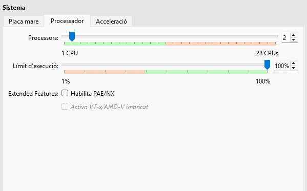

En aquesta part es on poden agefir i elimina les unitats d´emmegatzematge que anirem agefin durant l´activitat
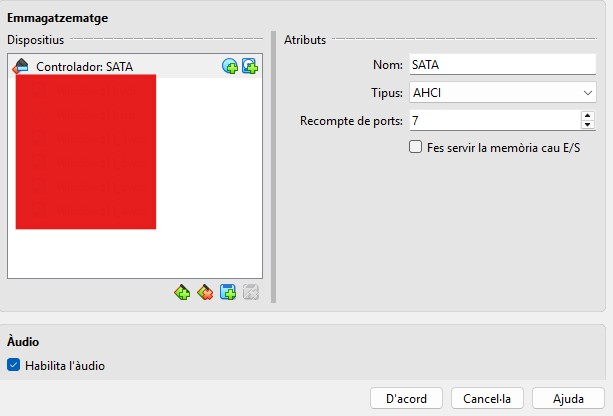

## **Efecte mirall doble:** 

## **Partició del disc:**

Primer de tot entrerem a **“administrar espacios de almacenamiento”:**

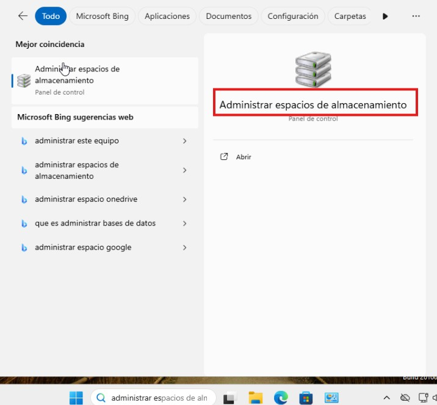

Un cop dins crearem un espai de disc d'emmagatzematge, (entrem a la opció marcada).

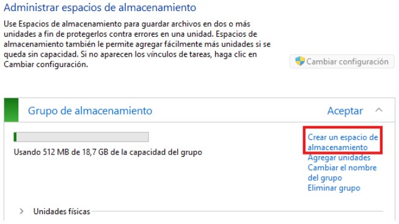

I s´obrirà aquest panell, que al que haurem de fer serà posar les característiques que volem que tingui al nostre disc.  
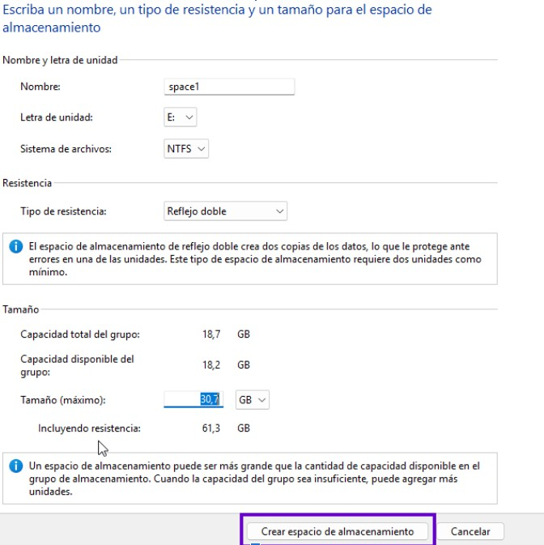

Un cop haguem posat totes les característiques, acabarem de crear al disc del tot, fen clic a la part marcada.

Ara ja podem veure el disc principal i veurel partit en dos particions en efecte mirall.

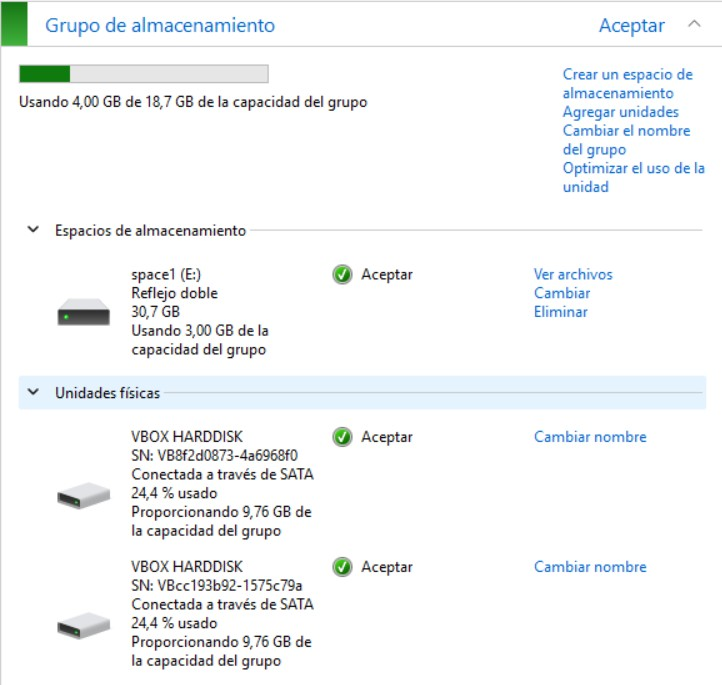

## **Posar informacío dins del disc i eliminar 1 disc:**

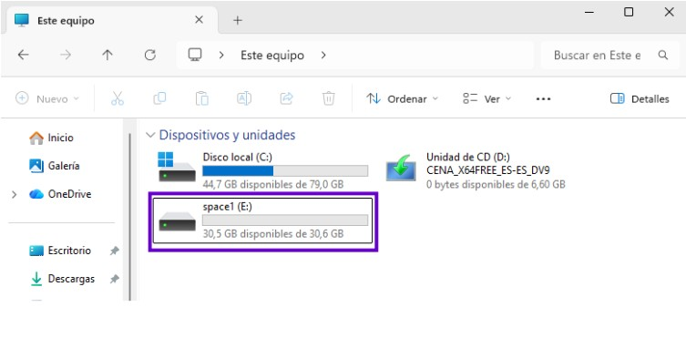

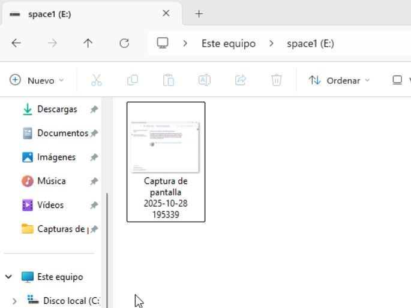
Ara tancarem la màquina virtual i eliminem un disc de la mateixa manera que abans haviem creat un.

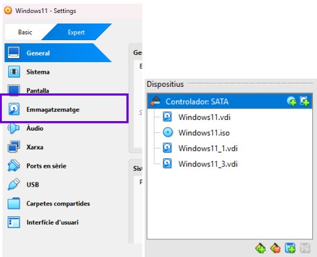

Ara podem veure que hi ha una partició que no funciona correctament, ja que hem eliminat un disc de la màquina virtual. Ara mirarem si s'ha guardat la informació en l´altre partició, per comprovar si l´efecte mirall s'ha creat correctament.  

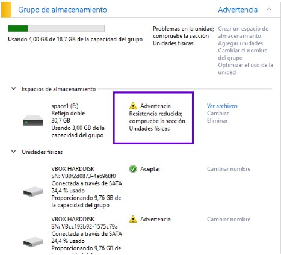

En aquesta imatge es pot veure que se'ns ha guardat la informació correctament ✅:

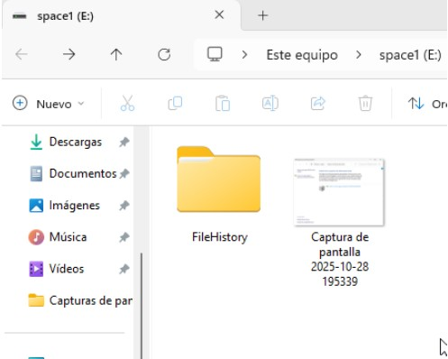

I ara podem afegir un altre cop al disc perquè no ens dongui cap error i estigui tot correcte.

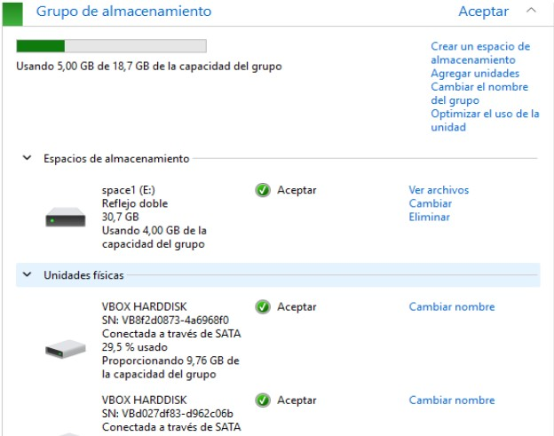

## **Efecte mirall triple:** 

Ara al primer que farem serà borrar el disc de paritat doble que hem fet per la part anterior. Un cop l´hem eliminitat hem d'afegir els discos necesaris fins a tenir 5:

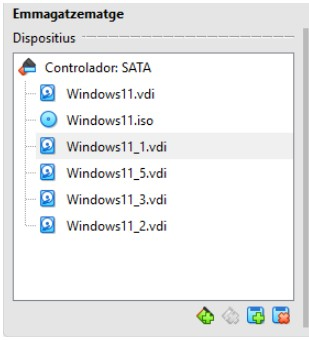

I haurem de agregar les unitats fins a tenir 5, per poder fer la partició de mirall triple.  

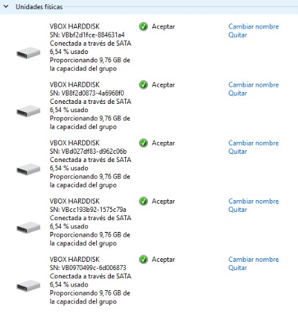

Ara haurem de crear un espai d´emmagatzematge amb els 5 discos com també em fet amb la part anterior, però amb **reflejo triple.**

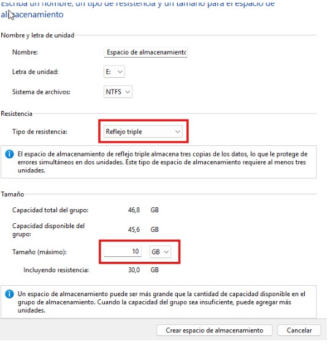
                    

Amb amb aquesta imatge es pot comprovar que s´ha creat correctament.

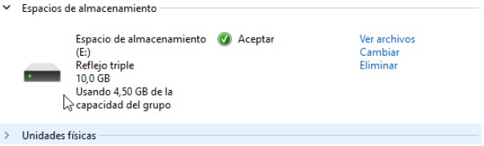

Ara posarem arxius dins, del disc i eliminem una de les unitats que hem afegit desde al VM, per veure que pasa.

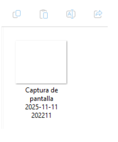

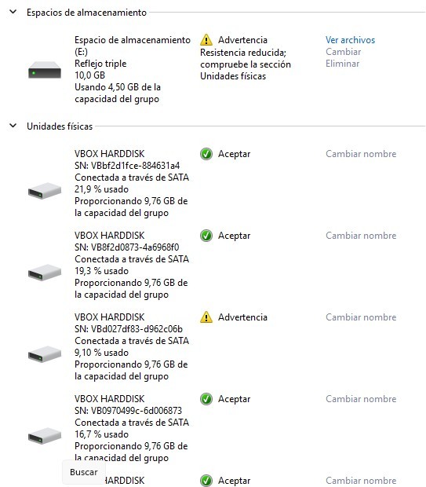

En aquesta imatge es pot veure que ja em trencat una de les unitats partides.

I en aquí ja es veu que seguim tenint l'arxiu, la unica diferencia es que ha distribuït la informació de recuperació entre els 5 discos partits per eficiència.

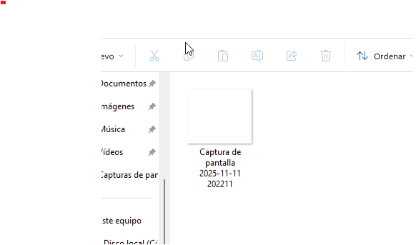
