### **4\. Integració de Client (Client Ubuntu Desktop)**

| ID | Descripció de la Tasca | Detalls de la Configuració |
| :---- | :---- | :---- |
| **T.CLI.01** | Instal·lació del Client. | Instal·lar un client Ubuntu Desktop i configurar la interfície de xarxa per comunicar-se amb el servidor (Host-Only). 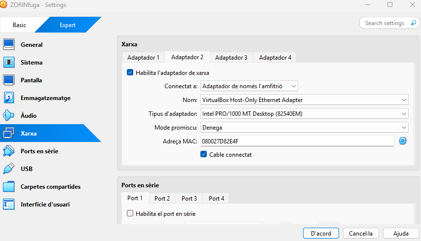 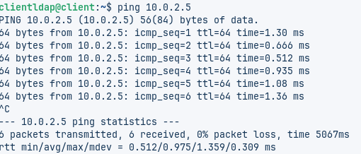 |
| **T.CLI.02** | Resolució de Noms. | Configurar l'arxiu d'**hosts** del client per resoldre l'adreça IP del servidor a **server.innovatechXX.test**. S'ha de proporcionar una instantània (snapshot) de la màquina client un cop fet el canvi. 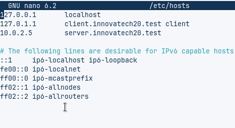 |
| **T.CLI.03** | Validació de la Connectivitat LDAP. | Comprovar la connectivitat amb el servidor fent una consulta **ldapsearch** des del client. 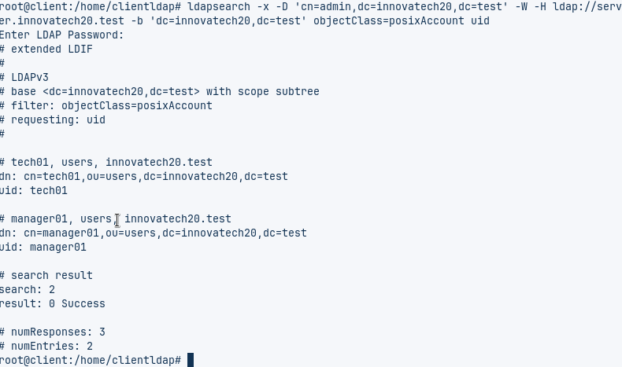 |
| **T.CLI.04** | Mòduls d'Autenticació. | Instal·lar els mòduls necessaris per permetre l'autenticació amb LDAP. 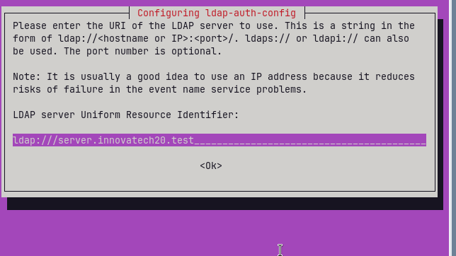 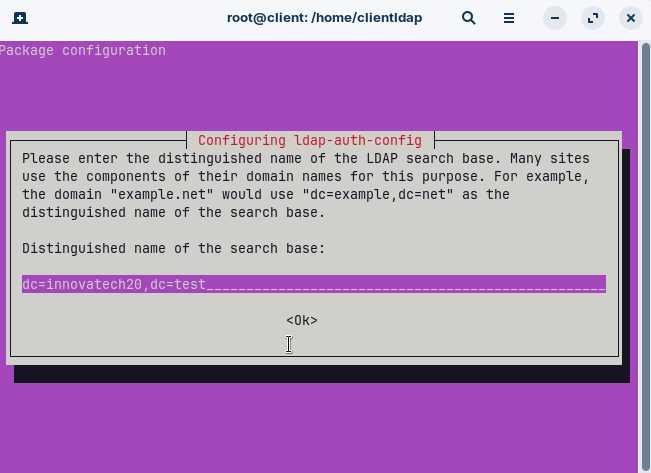 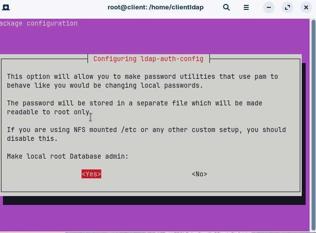 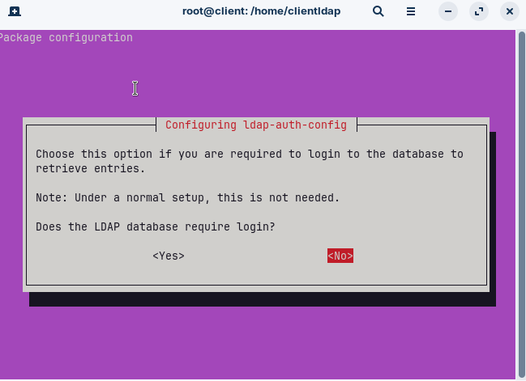 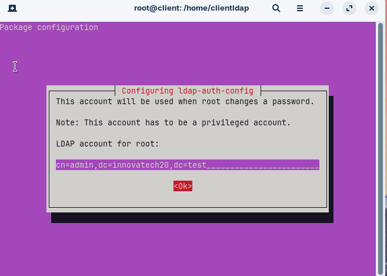 |
| **T.CLI.05** | Configuració del Client. | Modificar els arxius de configuració del client necessaris. S'han de mostrar **clarament els canvis realitzats** en el codi dels arxius. 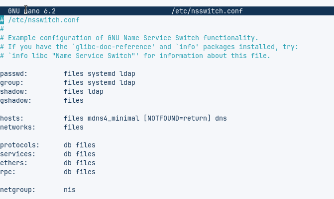 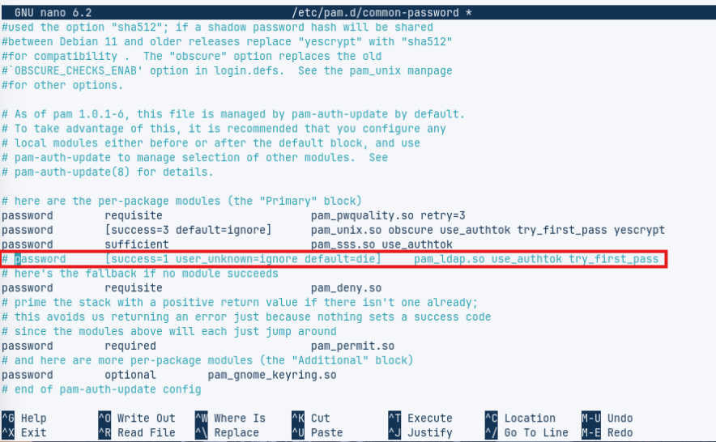 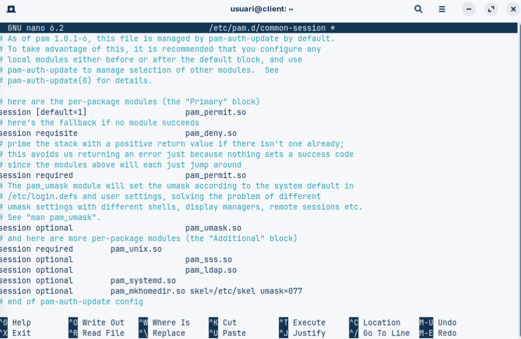|
| **T.CLI.06** | Comprovació del Sistema. | Reiniciar els serveis i verificar amb la comanda **getent passwd** que els usuaris del directori són visibles localment. 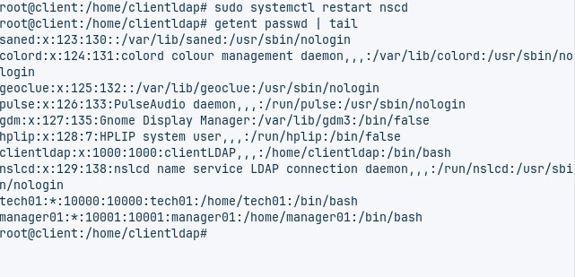 |
| **T.CLI.07** | Prova d'Accés Final. | Reiniciar el client i iniciar sessió amb l'usuari **tech01**. Es requereix una captura de pantalla que demostri l'accés correcte i la **creació automàtica de la carpeta personal** de l'usuari. 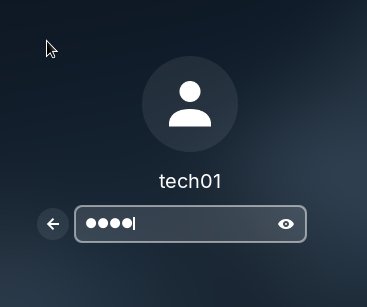 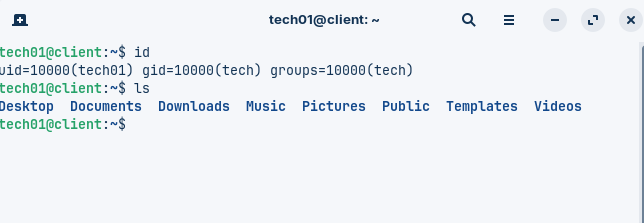 |

