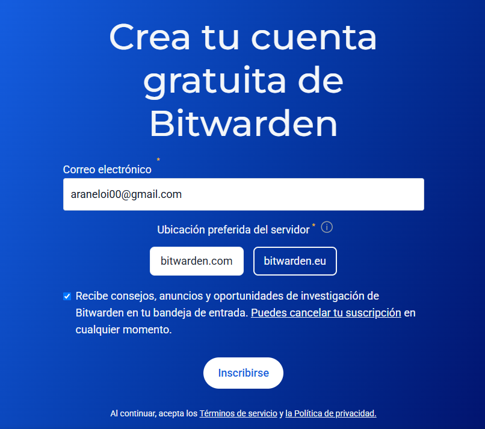
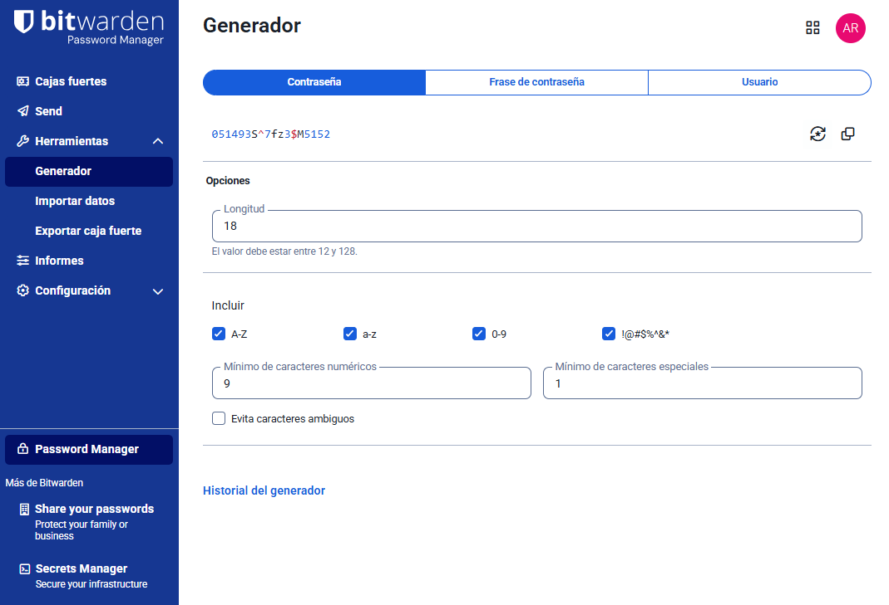

# Fase 2: Guia d’Ús Tècnica — Bitwarden

Aquesta guia explica com instal·lar, configurar i utilitzar **Bitwarden** per gestionar contrasenyes de forma segura dins de l’empresa EverPia.

---

##  1. Instal·lació i Configuració Inicial

###  Pas 1: Crear un compte Bitwarden
1. Hem de accedir aquest enllaç: [https://bitwarden.com](https://bitwarden.com)
2. Hem de fer clic a **Get Started** i després **Create Account**.
3. Hem de posar el nostre **correu electrònic** i crea una **contrasenya**.
4. I per últim verificar el teu correu electrònic.

>   

---

###  Pas 2: Iniciar sessió i accedir al gestor
- Entra a **https://vault.bitwarden.com/**
- Accedeix amb el teu compte nou.
- Se t’obrirà la **caixa forta** (Vault), on es guarden totes les credencials.

---

##  2. Generació de Contrasenyes Segures

1. Clica **Generator** (icona de daus 🎲 o menú lateral).
2. Configura els paràmetres:
   - Longitud: **mínim 16 caràcters**
   - Inclou **majúscules, minúscules, números i símbols**
3. Clica **Generate** i copia la contrasenya.

>    

---

##  3. Desar Credencials i Emplenament Automàtic

###  Exemple 1: Compte de correu
1. A la caixa forta, clica **Add Item**.
2. Tipus: **Login**.
3. Nom: *Correu corporatiu*
4. Usuari: *usuari@everpia.com*
5. Contrasenya: enganxa la generada.
6. Desa el registre.

>    

---

### Exemple 2: Credencial d’una aplicació o servei web
1. Obre el lloc web → Inicia sessió.
2. Quan el navegador et pregunti “Save in Bitwarden?”, selecciona **Save**.
3. A partir d’ara, Bitwarden emplenarà automàticament aquest login.

>    

---

##  4. Gestió de Còpies de Seguretat (Backup)

###  Exportació de la base de dades
1. A la web de Bitwarden, obre **Tools → Export Vault**.
2. Escriu la contrasenya mestra per confirmar.
3. Desa el fitxer `.json` o `.csv` (xifrat).

>    

---

###  Recomanació de seguretat
- Desa la còpia de seguretat en una **clau USB xifrada** o **disc dur segur**.
- Si cal emmagatzematge al núvol, utilitza **xifrat addicional (VeraCrypt o 7-Zip xifrat)**.
- **No deixis còpies sense xifrar** en carpetes compartides.

---

##  Bones pràctiques

- No reutilitzar contrasenyes, i tampoc en entorns interns.
- Canvia la contrasenya mestra de tant en quan.
- Mantenir actualitzada l’extensió i aplicació de Bitwarden.
- Evita introduir credencials en dispositius no corporatius.

---

## Conclusió

Amb Bitwarden, el personal tècnic d’EverPia pot:
- Gestionar de manera segura totes les credencials.
- Compartir contrasenyes d’equip sense exposar-les.
- Garantir la continuïtat operativa i la seguretat corporativa.

>  La seguretat comença amb una bona gestió de les contrasenyes.

