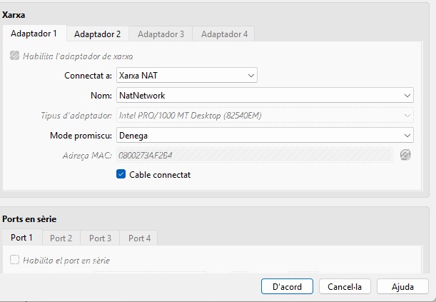

### **2\. Requeriments d'Infraestructura Inicial**

El consultor ha de verificar la correcta configuració de la infraestructura virtual abans d'iniciar la implementació:

| ID | Descripció del Requeriment | Configuració Requerida |
| :---- | :---- | :---- |
| **R.INF.01** | Configuració de la màquina Server (Server Hostname). | **server.innovatechXX.test**  |
| **R.INF.02** | Interfície de Xarxa Pública. | **NAT** (Per accés a Internet i descàrrega de paquets).  |
| **R.INF.03** | Interfície de Xarxa Privada. | **Host-Only** (Per a comunicació privada amb el Client virtual  i la màquina física).  |

### 

