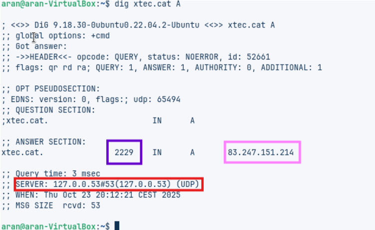
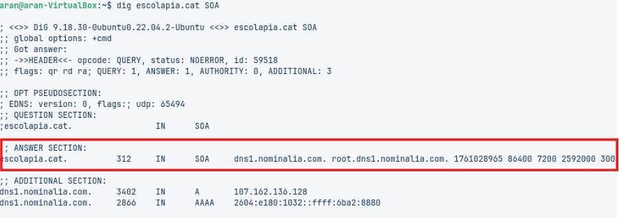
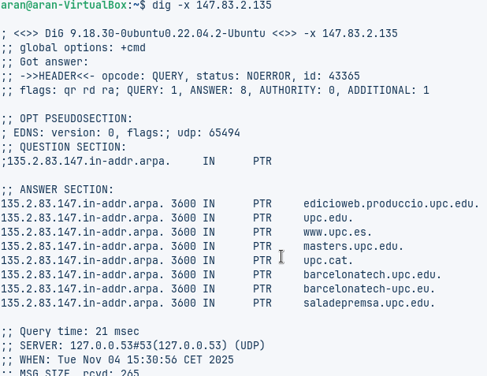

# Tasca6 Fonaments DNS. Guia comandes

**COMANDA 1:**  

Obrim la terminal, i posem la comanda **dig xtec.cat A** per consultar el registre DNS de tipus A del domini xtec.cat .  
El que fa és buscar el valor TTL (temps de vida, en segons).

**COMANDA 2:**  

El que fa la comanda **dig tecnocampus.cat NS** és treballar en un entorn de proves segur i aïllat, on es poden fer pràctiques o comprovacions de xarxa, com per exemple consultes DNS, sense afectar el sistema real.

**COMANDA 3:**  

La comanda **dig escolapia.cat SOA** serveix per realitzar proves i pràctiques de xarxa en un entorn segur i aïllat, on es poden consultar registres DNS (com el **SOA**).  
El que està rodejat de vermell són els **servidors de noms autoritatius** del domini.

**COMANDA 4:**  

El que fa aquesta comanda és mostrar quin domini està associat a la IP que indiquem, en aquest cas **147.83.2.135**.

# Comprovació de Resolució amdig b nslookup:

Amb aquesta comanda aconseguim fer la consulta DNS directa per obtenir les adreces IP associades a un nom de domini, que en aquest cas es, tecnocampus.cat.

Farem comanda “nslookup” i posarem set  type=NS 
Tecnocampus.cat  per poder veure els name server dels ns.

Mostra informació del servidor DNS per defecte que està utilitzant el teu ordinador o xarxa.

Mostra una altra consulta feta amb el comandament nslookup, i en aquest cas s’està consultant el registre A del domini tecnocampus.cat. +

